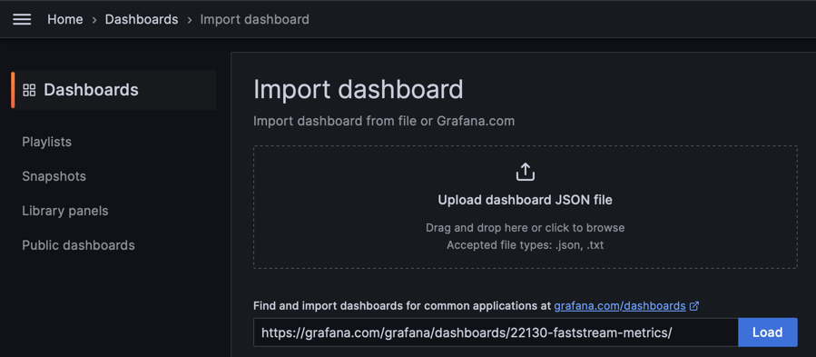
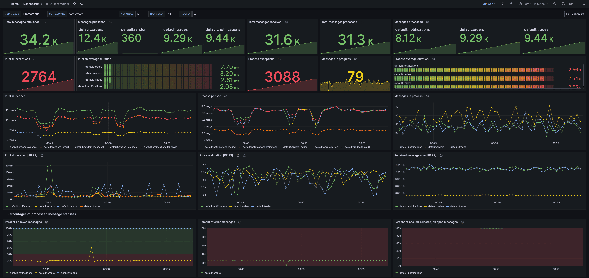

### Grafana dashboard

You can import the [**Grafana dashboard**](https://grafana.com/grafana/dashboards/22130-faststream-metrics/) to visualize the metrics collected by middleware.

Enter the dashboard **URL** `https://grafana.com/grafana/dashboards/22130-faststream-metrics/` (or just the **ID**, `22130`), and click on **Load**.

An [example](https://github.com/draincoder/faststream-monitoring) application with configured **metrics**, **Prometheus** and **Grafana**.

[FastStream Prometheus documentation](https://faststream.airt.ai/latest/getting-started/prometheus/)
